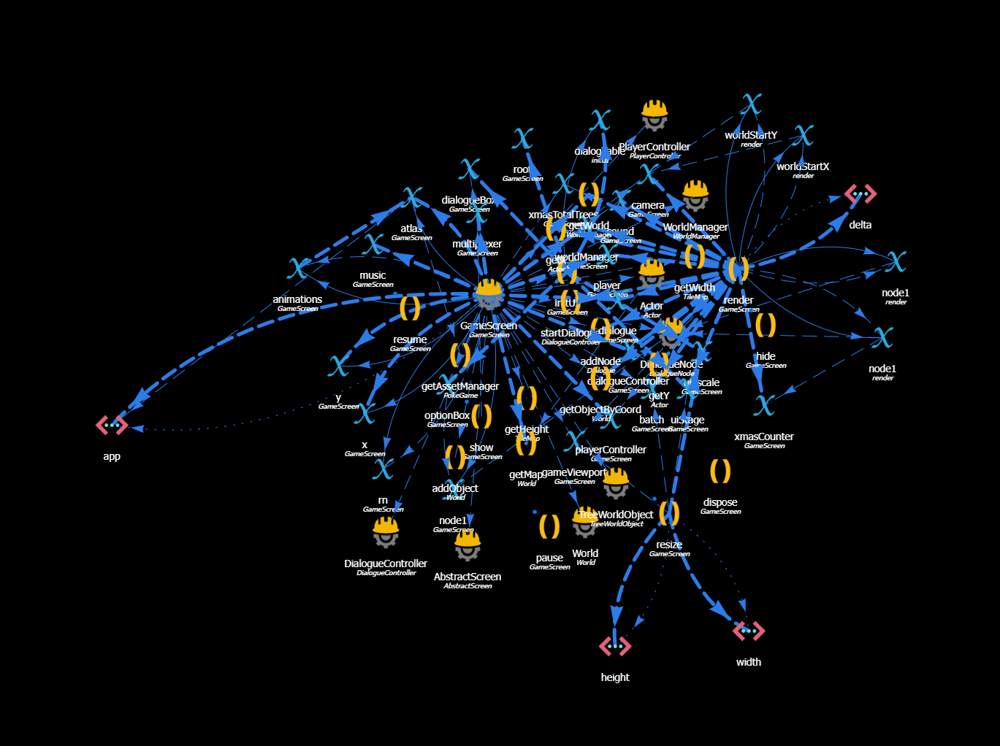

# POKEGAME CHRISTMAS VERSION
A Pokemon christmas game developed in java using gradle, maven and [libGBX](https://libgdx.com/). 

## How to play:
* Download the latest Release/Pre-Release of the [Christmas branch](https://github.com/papiricoh/PokemonGame/branches): [HERE](https://github.com/papiricoh/PokemonGame/releases/tag/xmasII)
* Download the Source Code and build it in the root folder with `gradlew desktop:dist`
* Download the Source Code and Run the [DesktopLauncher.java](https://github.com/papiricoh/PokemonGame/blob/master/desktop/src/com/papiricoh/pokegame/DesktopLauncher.java) class in InteliJ with `PokeGame/assets` as working directory

### Run in macOS:
* In the command prompt: `java -jar -XstartOnFirstThread [PATH TO EXECUTABLE.jar].jar`

## Credits:
* Code: [Papiricoh](https://github.com/papiricoh)
* Assets: [Rampager](https://github.com/MilanesaBolchevique), [LeCloutch](https://github.com/LeCloutch), [ElKalto](https://github.com/ElKalto)
* Original Soundtrack: [Rampager](https://github.com/MilanesaBolchevique)
* Art-Works: [ElKalto](https://github.com/ElKalto)
* Sound Effects: Game Freak (Pokemon Creators)

## Showcase:
### GameScreen.java:
